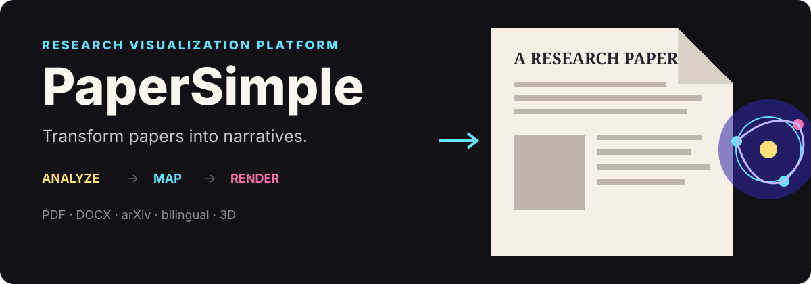

<p align="center">
  
</p>

<p align="center">
  <a href="https://ai.studio/apps/fcd7f267-d84f-4c89-bcc5-0cbccc10ce51"><strong>在 Google AI Studio 中打开</strong></a>
</p>

<p align="center"><a href="./README.md">English</a> · <strong>中文</strong></p>

PaperSimple 把一篇研究论文变成可探索的编辑式叙事。上传 PDF、DOCX、Markdown 或纯文本文件，或者给一个公开 URL，应用会抽取原文、识别其中的核心观点，并把适合可视化的概念映射成交互式图解。

## 从密集的论文到有引导的叙事

- 支持导入 PDF、DOCX、Markdown 和纯文本
- 在浏览器端抽取 PDF 的前 20 页
- 从 arXiv 拉取 AI、生物、化学和材料领域的近期论文
- 生成结构化的中英双语叙事
- 渲染表面码、transformer、度量、流程、图表和 3D 场景
- 本地收藏喜欢的论文
- 把生成的阅读体验导出为 PDF

内置的 AlphaQubit 叙事是一个完整的示例，包含表面码讲解、循环 transformer 视图和性能对比。

## 本地运行

前置条件：Node.js 和一个 Gemini API key。

```bash
cp .env.example .env
npm install
npm run dev
```

开发命令会同时启动 Express 代理和 Vite 应用。Gemini 调用走服务端，因此 API key 不会被有意放进客户端请求里。

验证改动：

```bash
npm run lint
npm run build
```

## 叙事流水线

| 阶段 | 实现 |
| --- | --- |
| 获取 | 文件上传、公开 URL 抓取，或 arXiv 查询 |
| 抽取 | PDF.js、Mammoth，或 UTF-8 文本解码 |
| 结构化 | 用 Gemini JSON schema 提取标题、导言、章节、作者和视觉线索 |
| 可视化 | React、Three.js / React Three Fiber，以及项目自有的 SVG 风格图解 |
| 呈现 | 带动效的编辑式排版，可中英切换 |
| 留存 | 浏览器本地收藏和 PDF 导出 |

## 重要限制

- URL 导入依赖远端资源是公开的、且能通过配置的代理路径取到。
- PDF 抽取目前最多读 20 页。
- 生成的讲解和图解可能遗漏或错述原文细节；依赖它们之前请核对原始出版物。
- 这是一个传播用的原型，不是同行评议、引用核实或科学验证系统。
- 近期论文的元数据来自 arXiv 检索，可能不代表期刊的正式出版记录。

## 关键文件

- [`App.tsx`](./App.tsx) — 发现、收藏、生成状态和内置叙事
- [`components/ArticleGenerator.tsx`](./components/ArticleGenerator.tsx) — 文件与 URL 抽取
- [`components/GeneratedArticle.tsx`](./components/GeneratedArticle.tsx) — 叙事呈现与导出
- [`components/Diagrams.tsx`](./components/Diagrams.tsx) — 科学图解组件
- [`components/QuantumScene.tsx`](./components/QuantumScene.tsx) — 3D 主视觉与量子场景
- [`services/geminiService.ts`](./services/geminiService.ts) — 结构化生成
- [`services/paperService.ts`](./services/paperService.ts) — arXiv 发现与本地翻译缓存
